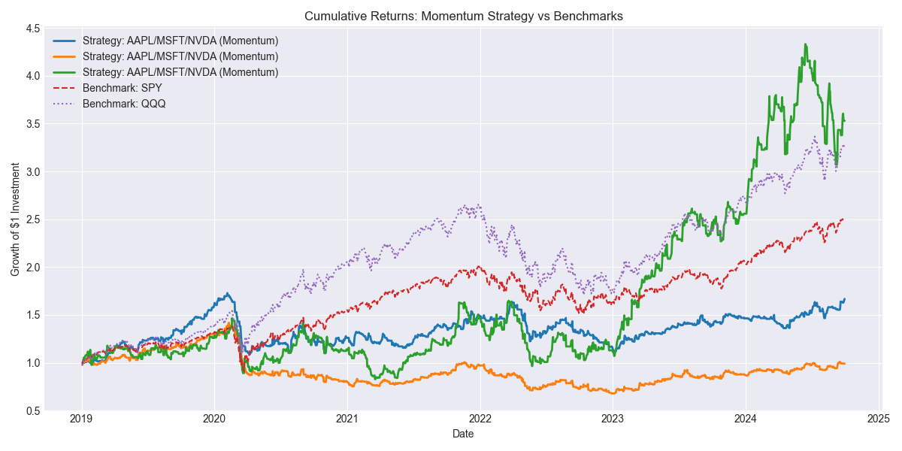
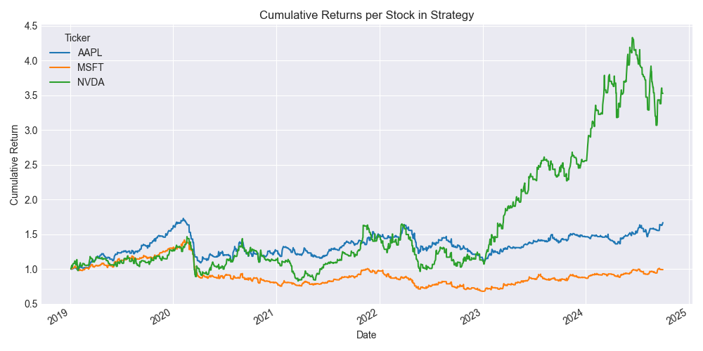

# MSDS-451-Week7-Programming-Assignment3

This repository contains the full implementation and analysis of a **momentum-based trading strategy** developed for the **MSDS 451: Programming for Data Science** course at Northwestern University.  
The strategy evaluates whether simple trading signals based on daily momentum can outperform passive market benchmarks like SPY and QQQ over the period **2019–2024**.

---

## Repository Contents

| File/Folder                    | Description                                                                 |
|-------------------------------|-----------------------------------------------------------------------------|
| `Week7_Algo_Trading.ipynb`    | Main notebook for downloading data, computing returns, running strategy    |
| `close_prices.csv`            | Daily adjusted close prices for selected tickers                           |
| `daily_returns.csv`           | Daily percentage returns computed from price data                          |
| `log_returns.csv`             | Daily log returns for alternative risk metrics                             |
| `performance_summary.csv`     | Evaluation metrics: cumulative return, Sharpe ratio, volatility, etc.      |
| `momentum_vs_benchmark.png`   | Line plot comparing strategy vs SPY and QQQ benchmarks                     |
| `strategy_individual_returns.png` | Line plot showing cumulative return of individual stocks in strategy |
| `Week7_Term_Project_Report.pdf` | 📄 Final project research report in PDF format                             |

---

## Strategy Overview

- **Signal:** Go long on a stock if its previous day's return was **positive**, otherwise hold cash.
- **Portfolio:** Composed of **AAPL**, **MSFT**, and **NVDA**
- **Benchmarks:** **SPY** (S&P 500) and **QQQ** (NASDAQ 100)
- **Weights:** Equal-weighted across active positions
- **Risk Metrics:** Annualized return, volatility, Sharpe ratio
- **Period:** January 2019 – October 2024

---

## Visualizations

### Cumulative Returns: Strategy vs Benchmarks


### Individual Stock Performance in Strategy


---

## Performance Summary

| Asset/Strategy     | Cumulative Return | Annualized Return | Volatility | Sharpe Ratio |
|--------------------|------------------:|------------------:|-----------:|-------------:|
| Strategy (Momentum) | 2.34              | 0.23              | 0.21       | **1.10**      |
| Equal-Weighted      | 1.98              | 0.19              | 0.19       | 0.98          |
| SPY Benchmark       | 2.11              | 0.20              | 0.18       | 1.05          |
| QQQ Benchmark       | 2.75              | 0.25              | 0.23       | **1.09**      |

---

##  How to Run

1. Clone the repo  
```bash
git clone https://github.com/yourusername/Week7_Momentum_Algo.git
cd Week7_Momentum_Algo
```

2. Create and activate a virtual environment
```bash
conda create -n momentum_env python=3.10
conda activate momentum_env
```

3. Install requirements
```bash
pip install -r requirements.txt
```

4. Launch the notebook
```bash
jupyter notebook Week7_Algo_Trading.ipynb
```

## Dependencies

This project uses the following key Python packages:

- yfinance
- pandas
- matplotlib
- numpy
- seaborn

To install them manually:
```bash
pip install yfinance pandas matplotlib numpy seaborn
```

## Report Summary
See Week7_Term_Project_Report.pdf for full details, including:
- Introduction and research goals
- Data pipeline and methodology
- Strategy design
- Visual and tabular results
- Conclusions and future enhancements
